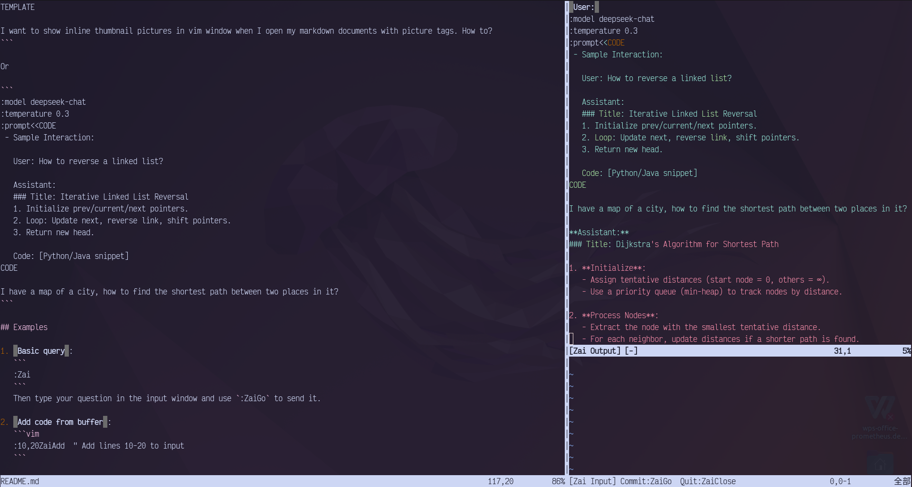

# Zai.Vim DeepSeek AI Assistant



Zai.Vim is a Vim plugin that seamlessly integrates the DeepSeek AI Assistant into your Vim editor. It allows you to access DeepSeek's intelligent services while coding or writing documents, without interrupting your workflow.

## Features

- **Dual-pane Interface**: Independent input/output windows for smooth interaction
- **Flexible Configuration**: Switch models/prompts mid-conversation
- **File Attachments**: Attach text files as conversation context
- **Session Logging**: Automatic conversation history preservation

## Installation

### Requirements

- Vim 8.0+ or Neovim
- Python 3.6+
- DeepSeek API key (set as `DEEPSEEK_API_KEY` environment variable)
- Required Python packages:
  - `openai` (auto-install attempted if missing)

### Using a plugin manager

With [vim-plug](https://github.com/junegunn/vim-plug):

```vim
Plug 'zighouse/zai'
```

With [Vundle](https://github.com/VundleVim/Vundle.vim):

```vim
Plugin 'zighouse/zai'
```

[lazy.nvim](https://github.com/folke/lazy.nvim):
```lua
-- Create zai-vim.lua in .config/nvim/lua/plugins/
return {
    {
        "zighouse/zai.vim",
        config = function()
            vim.g.zai_default_model = "deepseek-coder"  -- Optional config
            -- vim.g.zai_log_dir = my-log-dir           -- Optional config
        end
    }
}
```

Manual Installation:  

```
git -C ~/.vim/plugged clone https://github.com/zighouse/zai.vim
```  

## Core Concepts
### Session Logs
Zai automatically saves conversation history. Each session (from opening Zai until closing with `:ZaiClose`) generates a log file:
- Linux/Mac: `~/.local/share/zai/log`  
- Windows: `%USERPROFILE%\AppData\Local\zai\log`
- Or specified by `g:zai_log_dir`

### Session Modes
- **Chain Mode**: Maintains full conversation context (ideal for complex tasks)
- **Instant Mode**: Single-turn interactions (ideal for simple Q&A)

Switch modes using session commands:
```
:talk_mode chain   # Enable chain mode
:talk_mode instant # Enable instant mode
```

## Usage

### Key Mappings
| Key Binding     | Command       | Description                  | Mode          |
|-----------------|---------------|------------------------------|---------------|
| `<Leader>zo`    | `:Zai`        | Open Zai interface           | Normal        |
| `<Leader>zg`    | `:ZaiGo`      | Send query                   | Insert        |
| `<Leader>zX`    | `:ZaiClose`   | Close session                | Normal        |
| `<Leader>za`    | `:ZaiAdd`     | Add visual selection to input | Visual        |

### Session Commands

At any time you can use following commands Zai input pane to change the mode or parameters of following conversation. You can select a new model or a new system prompt for a new request.

Note that the session commands here are entered in the Zai input box, not as Vim commands in command mode. Enter the following instructions in the input box and use `:ZaiGo`/`<Leader>zg` to send them.

Prefix commands with `:` in input area:

- `:help` - Show help message
- `:exit`/`:quit` - Force to exit the background job
- `:talk_mode` - Set conversation mode (chain, instant)
- `:base_url <url>` - Change the base-url to a new one
- `:api_key_name <api-key-name>` - Provide the environment of the API-KEY for new base-url
- `:model <name>` - Set model (deepseek-coder, deepseek-chat, deepseek-reasoner, etc.)
- `:temperature <value>` - Set creativity (0-2)
- `:prompt <text>` - Set system prompt (single line system prompt content)
- `:file <path>` - Attach a text file
- `:->/` - Change command prefix to `/`

### Change the talk-mode in conversation

You can change the talk-mode from chain to instant at any time.

When in chain talk-mode, you chain all your history conversation as context along with you last request content and send to DeepSeek service. 

```
:talk_mode chain
```

When in instant talk-mode, you only send the last request content without previous conversation context.  

```
:talk_mode instant
```

Inspite which mode you choose, all conversation contents in a Zai session are logged into one file. If you want to start a new session, close it with `ZaiClose` command or `<Leader>zX`.


### Specifying DeepSeek Models  
Currently in DeepSeek's services, available large language models (LLMs) include `deepseek-coder`, `deepseek-chat`, `deepseek-reasoner`, etc.  

To specify a particular model, enter the following command in the input box. For example, to use the reasoning model, send this instruction:  
```
:model deepseek-reasoner
```  
You can switch between different models within a single session by including this command in the input box and sending it to Zai's background task. The specified model will then be applied to new conversations.  

### Specifying AI Base URL and Access Parameters

You can choose your AI service provider by setting parameters of `base_url`, `api_key_name` and `model`. The default settings:
```
:base_url       https://api.deepseek.com
:model          deepseek-chat
:api_key_name   DEEPSEEK_API_KEY
```

Note that different AI service provider often use different model names for an opensource model. You should pickup the `model` from the models list of your AI service provider.

You should acquire an API-KEY from your AI service provider, and put it in an environment variable, and provide the variable name as `api_key_name`.

Note that you should keep your API-KEY secret.

### Specifying Creativity Parameters  
In DeepSeek services, models like `deepseek-coder` and `deepseek-chat` support fine-tuning conversation effects through parameters such as `temperature`. Zai allows you to adjust these parameters by including commands like the following in the input box:  

```
:temperature 0.3
```  

Other available parameters in Zai include `top_p`, `max_tokens`, `presence_penalty`, `frequency_penalty`, and `logprobs`. For detailed usage, refer to [Chat Completion Documentation](https://api-docs.deepseek.com/api/create-chat-completion).  

To clear previously set parameters, insert a minus `-` between the command prefix and parameter name. For example, to reset the `temperature` setting:  
```
:-temperature
```  

### Multi-line Input in Zai Interface and Block :prompt Syntax

Zai supports multi-line input through a special block syntax, making it easy to submit complex prompts or code examples to DeepSeek. All you need is to write your request content in input pane and send it to DeepSeek.

You also can override the default one with well considered and a multi-line block of text. The block input system makes it easy to have structured conversations with DeepSeek while maintaining clean, readable prompts in your Vim workflow.

To make multiple lines as a system prompt:
1. Start with `:prompt<<EOF` (or any unique marker)
2. Enter your well defined content line by line for new prompt
3. End with `EOF` (or your chosen marker)

You can structure your prompt to get well-formatted:

```
:model deepseek-reasoner
:prompt<<TEMPLATE
 - "As a code-specialized AI, analyze the problem step-by-step. Always start your final answer with a bolded title summarizing the solution."  
 - Example output format:  
   ### [Solution Summary]
   [Step-by-Step Explanation]  
TEMPLATE

I want to show inline thumbnail pictures in vim window when I open my markdown documents with picture tags. How to?
```

Or

```
:model deepseek-chat
:temperature 0.3
:prompt<<CODE
 - Sample Interaction:  

   User: How to reverse a linked list?  

   Assistant:  
   ### Title: Iterative Linked List Reversal
   1. Initialize prev/current/next pointers.  
   2. Loop: Update next, reverse link, shift pointers.  
   3. Return new head.  

   Code: [Python/Java snippet]
CODE

I have a map of a city, how to find the shortest path between two places in it?
```

#### Clearing Custom Prompts  
Use the following command to clear user-configured prompts (restoring Zai's default prompts):  

```
:-prompt
```  

### Attaching Files  
You can conveniently attach multiple text files as context for consultation in Zai. Include the following command in the input box to attach a file (one attachment command per line):  
```  
:file path/to/file.txt  
```  
- Supports relative paths based on Vim's `:pwd`  
- Only text files can be attached  
- The number of files and content length depend on the model's context token limit (currently 64K tokens max for DeepSeek API services). Avoid attaching excessive/large files.  

Use this command to remove previously attached files:  
```  
:-file path/to/file.txt  
```  

### Command Prefix and Escaping  

Zai uses colon `:` as the default command prefix.  

When a line starting with this prefix appears in the input, it will be interpreted as a session command rather than query content. The command format is:  
```
:command_name [arguments]
```  

**Two escape methods for colon-prefixed content**:  
1. **Prefix Escaping**  

For occasional colon-prefixed lines, escape by doubling the colon:  
```
::quit my asm program  
```  
Output as normal text: `:quit my asm program`  

2. **Prefix Replacement**  
For bulk colon-prefixed content, change the command prefix using:  
```
:->/  
```  
Now `/` becomes the new command prefix (e.g. `/attach file.txt`), freeing `:` for normal use.  

**Available command prefix characters**:  
```  
: / ~ \ ; ! # $ % & ? @ ^ _ * + = , . < > ` ' " ( ) [ ] { }  
```  

*Note: Hyphen/minus `-` is excluded due to its special "clear" semantics.*  


## License

Zai.vim is released under the MIT License. See the [LICENSE](https://github.com/zighouse/zai/blob/main/LICENSE) file for details.  
