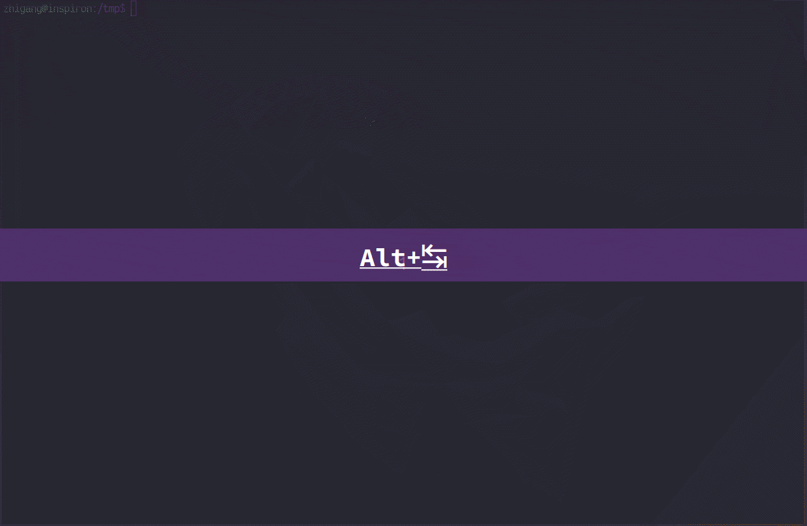

# Zai.Vim DeepSeek AI助手



Zai.Vim 是一款将 DeepSeek AI助手直接集成到您的 Vim 编辑器中的 Vim 插件，当您在使用 Vim 进行代码编辑或文档撰写时，可以在 Vim 中无缝地使用它快速访问 DeepSeek 等大语言模式提供的智能服务，在 Zai 与大模型交互给您带来便利的同时，它并不会打扰您当前的编辑撰写工作。

## 功能特性

- **双窗格界面**：独立的输入输出窗口实现无缝交互
- **灵活选择**：在一个会话中允许中途变更使用的模型、提示词等
- **文件附件**：允许附加文本文件作为交互的上下文
- **会话日志**：保存对话历史记录

## 安装指南

### 环境要求

- Vim 8.0+ 或 Neovim
- Python 3.6+
- DeepSeek API密钥（需设置为`DEEPSEEK_API_KEY`环境变量）
- 必需Python包：
  - `openai`
  - `chardet`
  - `appdirs`

### 使用插件管理器

通过[vim-plug](https://github.com/junegunn/vim-plug):

```vim
Plug 'zighouse/zai'
```

通过[Vundle](https://github.com/VundleVim/Vundle.vim):

```vim
Plugin 'zighouse/zai'
```

通过[lazy.nvim](https://github.com/folke/lazy.nvim)

在 .config/nvim/lua/plugins/ 中创建一个 zai-vim.lua 文件，内容如下：

```lua
return {
    {
        "zighouse/zai.vim",
        config = function()
            -- 可选配置
            vim.g.zai_default_model = "deepseek-coder"
            vim.g.zai_log_dir = my-log-dir
            vim.g.zai_lang = 'zh_CN.UTF-8'
        end
    }
}
```

手动安装:

在 Linux/Mac 上的终端命令窗口上执行的命令：

```bash
pip install appdirs chardet openai
mkdir -p ~/.vim/pack/plugins/start
cd ~/.vim/pack/plugins/start
git clone -n --depth=1 https://github.com/zighouse/zai.vim.git
git checkout
```

在 Windows 上的终端命令窗口上执行的命令：

```dos
pip install appdirs chardet openai
md %USERPROFILE%\vimfiles\pack\plugins\start
cd %USERPROFILE%\vimfiles\pack\plugins\start
git clone -n --depth=1 https://github.com/zighouse/zai.vim.git
git checkout
```

进入安装目录下执行 `git pull` 即可手动更新。

也可以[下载 zip 包](https://github.com/zighouse/zai.vim/archive/refs/heads/main.zip)，解压后把 zai.vim-main 文件夹放到对应的目录下。

## 基本概念

### 日志

Zai 会妥善保存和 DeepSeek 大语言模型服务所做的每一次交互。每一个 Zai 会话（从打开 Zai 到使用命令 `:ZaiClose` 关闭）都会保存一个日志文件。
- Linux/Mac: `~/.local/share/zai/log`
- Windows: `User\AppData\Local\zai\log`
- 或者在 .vimrc 中使用 `g:zai_log_dir` 指定

推荐：在 Windows 上配置新的日志存放路径。Windows 上的默认日志存放路径被系统隐藏，使用不便利。

### 会话模式
- **链式模式**：携带完整历史上下文 （适合深入探讨复杂问题）
- **即时模式**：仅发送当前内容 （更少的输入 tokens，适合简单问答）

切换方式：在输入框中使用 Zai 会话指令：
```
:talk_mode chain  # 切换至链式模式
:talk_mode instant # 切换至即时模式
```

## 使用说明

### 快捷键映射

| 快捷键            | 命令          | 描述                          | 模式          |
|-------------------|---------------|-------------------------------|---------------|
| `<Leader>zo`      | `:Zai`        | 打开Zai交互界面               | 普通模式      |
| `<Leader>zg`      | `:ZaiGo`      | 发送当前输入到DeepSeek        | 插入模式      |
| `<Leader>zX`      | `:ZaiClose`   | 关闭当前Zai会话               | 普通模式      |
| `<Leader>za`      | `:ZaiAdd`     | 添加可视化选区到输入区        | 可视模式      |
| `<CR>` (输入窗口) | `:ZaiGo`      | 发送当前输入区内容到 DeepSeek | 普通模式      |

## Zai会话中使用的指令

需要注意的，这里的会话指令是在 Zai 输入框中输入的内容，而不是在 Vim 命令模式下输入的 Vim 命令。在输入框中输入如下指令，并使用 `:ZaiGo`/`<Leader>zg` 发送。

Zai 会话指令允许和用户发送给 DeepSeek 的咨询内容同时在输入框中混在一起编排，但需要注意的是在输入框中包含 Zai 会话指令时，应该保证每条指令独占一行。另外，建议把 Zai 会话指令放到咨询内容的前面，并使用空行和咨询内容分隔开。

在 Zai 输入框中，您随时可以使用以下前缀为 `:` 的特殊指令来改变接下来与大语言模型交谈时的模型、提示词或者参数等：

- `:help` - 显示帮助信息
- `:exit`/`:quit` - 强制退出后台任务
- `:talk_mode` - 设置会话模式（chain链式, instant即时）
- `:base_url <url>` - 使用新的大模型服务的 base-url
- `:api_key_name <api-key-name>` - 在一个环境变量上提供 base-url 对应的访问口令
- `:model <名称>` - 设置模型（deepseek-coder, deepseek-chat, deepseek-reasoner等）
- `:temperature <值>` - 设置创造性（0-2）
- `:prompt <文本>` - 设置系统提示词（单行）
- `:file <路径>` - 附加文本文件
- `:->/` - 将指令前缀改为`/`

### 会话模式

在链式对话模式（chain talk-mode）下，系统会将您的历史会话记录与最新请求内容串联作为上下文，并发送至DeepSeek服务进行处理。

```
:talk_mode chain
```

在即时对话模式（instant talk-mode）下，系统仅发送最新请求内容，不包含之前的会话上下文。

```
:talk_mode instant
```

无论选择何种模式，所有会话内容都会记录到同一日志文件。如需新建会话，请使用 `:ZaiClose`/`<Leader>zX` 关闭当前会话以及 Zai 界面。

### 指定 DeepSeek 模型
目前在 DeepSeek 提供的服务中，可以使用的大语言模型有 `deepseek-coder`、`deepseek-chat`、`deepseek-reasoner` 等。

可以在输入框中输入如下指令，指定使用具体的模型，例如指定使用推理模型，应该在输入框中发送如下内容：

```
:model deepseek-reasoner
```

您可以在一次会话中使用这个方法来回切换不同的模型，只需要在输入框中包含这条指令，并发送给 Zai 的后台任务，就会在新交谈中应用指定模型。

### 指定大模型服务的参数

通过 `base_url`、`api_key_name` 和 `model` 来指定大模型的服务位置。缺省情况下，这三者配置为：

```
:base_url       https://api.deepseek.com
:model          deepseek-chat
:api_key_name   DEEPSEEK_API_KEY
```

针对不同的 `base_url`，需要查阅对应服务商的相关列表来了解拥有哪些可以使用的聊天大模型。

### 指定创造性

目前在 DeepSeek 提供的服务中，对于 `deepseek-coder` 和 `deepseek-chat`，可以使用 `temperature` 等多个模型参数，对交谈的效果进行微调。Zai 中允许您使用这些模型参数，调节 `temperature` 的方法在输入框中包含如下类似的内容：

```
:temperature 0.3
```

可以在 Zai 输入框中使用的类似参数还有 `top_p`、`max_tokens`、`presence_penalty`、`frequency_penalty`、`logprobs`。这些参数的具体用法参见[对话补全](https://api-docs.deepseek.com/zh-cn/api/create-chat-completion)。

可以在指令前缀和指令名之间插入一个减号 `-` 的指令形式来清除之前所做的参数设置。例如，清除之前设置的创造性参数 `temperature` 的设置，使用如下会话指令：

```
:-temperature
```


### 设置系统提示词

注意区分 DeepSeek API 文档中提及的 prompt 指的是用户咨询的内容，是一条“用户消息内容(user message content)”，在这里 Zai 的 prompt 是设置 DeepSeek 对话环境的 系统提示词，是一条“系统消息内容(system message content)” 。

#### 单行提示词

可以在输入框中包含如下指令来改变 Zai 的默认提示词：

```
:prompt 请至少从三个角度分析，每个角度均应逐步思考，最后做综合性总结。
```

上面的提示词仅允许设置一行的内容。当希望使用多行内容作为系统提示词时，需要用到 Zai 的块状 `:prompt` 语法。

#### 多行提示词（块状 `:prompt` 语法)

Zai 支持通过特殊块语法实现多行输入，便于向 DeepSeek 提交复杂提示词或代码示例。通过精心设计的块状文本来覆盖默认提示词，这样让您能与 DeepSeek 进行结构化对话，同时保持 Vim 工作流程中的提示词清晰可读。

和其它的 Zai 会话指令一样，块状 `:prompt` 提示词也是允许和用户的咨询内容一同在输入框中编排并一同发送的。建议把块状提示词和其它 Zai 会话指令放到一起，使用多行空行和您的咨询内容分隔开。因为块状提示词占多行，当一并发送的内容中还包含有其它的 Zai 会话指令时，建议把其它指令放到块状提示词的前面。

设置多行系统提示词的方法：

1. 以 `:prompt<<EOF` 开头（`EOF` 可为任意唯一标记）
2. 逐行输入新提示词内容
3. 以 `EOF` 结尾（或您指定的标记）

结构化提示词示例：

```
:model deepseek-reasoner
:prompt<<PROMPT
 - "作为代码专家AI，请分步分析问题。最终答案始终以加粗标题总结解决方案。"
 - 示例输出格式：
   ### [解决方案摘要]
   [分步解释说明]
PROMPT

我想在vim窗口中打开含图片标签的markdown文档时显示内联缩略图，如何实现？
```

又例如：

```
:model deepseek-chat
:temperature 0.3
:prompt<<CODE
 - 示例交互：
   用户：如何反转链表？
   助手：
   ### 标题：迭代式链表反转
   1. 初始化prev/current/next指针
   2. 循环：更新next，反转链接，移动指针
   3. 返回新头节点

   代码：[Python/Java片段]
CODE

我有一张城市的电子地图，如何找到两地间最短路径？
```

#### 删除提示词

可以使用如下指令来清除用户设置过的提示词(回到 Zai 的默认提示词)：

```
:-prompt
```

### 附加文件

您可以在 Zai 中很方便地附加多个文本文件作为需要咨询的上下文。在输入框中包含如下指令，即可附加一个文件。每行仅限一个文件的附加指令。

```
:file  my-file-path
```

- 可以使用相对于 Vim 的 `:pwd` 的相对路径。
- 需要保证附加的是文本文件。
- 可以附加的文件的个数和文件内容的长度取决于模型可以接受的上下文 tokens 长度。需注意到当前的 DeepSeek API 服务提供的各模型上下文长度最大只有 64K，所以不宜附加过多的文件，也不宜附加过长的文件。

可以使用如下指令删除之前附加的文件：

```
:-file
```

### 会话指令前缀与转义

在 Zai 中默认使用冒号 `:` 作为会话指令的前缀。

当发送给 Zai 后台任务的内容中出现一行由指令前缀开头的文本时，这条内容通常会被当成一条会话指令而不是用户的咨询内容来解释。指令前缀之后紧跟着的是会话指令的名称，通过空格字符分隔开指令的参数。

```
:command_name [arguments]
```  

当用户希望在咨询内容中包含由冒号开头的文本行内容时，可以使用两种方法来避免将它们当成会话指令。
1. 使用指令前缀转义
2. 更换指令前缀

当包含少量的指令前缀字符(冒号)引导的文本行时，您可以通过在指令前缀字符(冒号)前再插入一个指令前缀字符(冒号)，就可以把这个指令前缀的意义取消。例如：

```
::quit my asm program
```

当包含大量指令前缀字符(冒号)引导的文本行，或者需要在咨询内容中特别使用指令前缀字符(冒号)引导格式时，可以变更 Zai 会话指令的前缀，使用另一个符号来代替。例如：

```
:->/
```

这样就把 `/` 当成了新的 Zai 会话指令前缀，原来的冒号就可以随意使用了。

可以用作指令前缀的字符有:

```
: / ~ \ ; ! # $ % & ? @ ^ _ * + = , . < > ` ' " ( ) [ ] { }
```

需要注意可以作为会话指令前缀的符号中没有减号`-`，因为减号有清除的语义。


## 许可协议

Zai.vim 在MIT许可证下发布，详情见[许可证](https://github.com/zighouse/zai/blob/main/LICENSE)文件。
